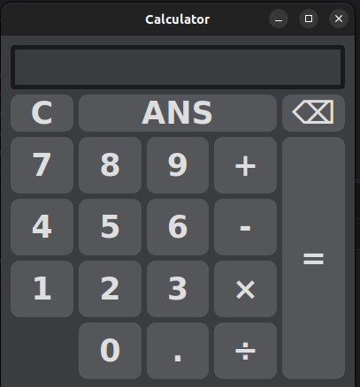

# PyQt5 Calculator

A basic deskstop calculator built using Python and PyQ55

This project was mainly created to further understand, improve, and practice GUI development, event-driven programming, and expression parsing without relying on Python's `eval()` function.

## Features 

Basic arithmetic operations 
- Addition
- Subtraction
- Multiplication 
- Division

Expression parsing with operator precedence 
- Math operations such as division and multiplication are handled/evaluated before addition and subtraction.

Decimal numbers are supported 

Negative numbers and their arihmetic are supported

ANS functionality
- Provides the ability to reuse the previous calculation.

Keyboard shortcuts 
- Instead of only supporting by mouse ,we have also made keyboard support available
- Number Keys
- Operators (+, -, *, /)
- Both Enter and Return keys for calulation
- Backspace support

Calculation History
- By pressing Left/Right Arrow keys , you can browse previous expresssions

Dark mode user interface

Division by zero protection

## Screnchots

### 

## Technologies Used

- Python 3
- PyQt5

## How to Run

### Clone the repository

```bash
git clone <your-repository-url>
cd Calculator
```

### Install dependencies

```bash
pip install PyQt5
```

### Run the application

```bash
python main.py
```

## Keyboard Controls 
| key | Action |
|------|--------|
| 0-9 | Number Input |
| + - * / | Operators|
| Enter | Calculation Result|
| Backspace | Delete LAST Character|
| Left Arrow | Previous Expression |
| Right Arrow | Next Expression|
| C | Clear Display|
| ANS | Insert Previous Result |

## Learning Outcomes

This project helped me practice:

- Object-Oriented Programming (OOP)
- GUI Development with PyQt5
- Event Handling
- Keyboard Event Processing
- Expression Parsing
- Operator Precedence Logic
- Application Styling using Qt Stylesheets

## Future Improvements

- Parentheses support
- Scientific calculator functions
- Light/Dark theme toggle
- Expression history panel
- More Math functions 
- Memory operations (M+, M-, MR)
- Better UI 

## Author

Aaditya Patil